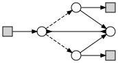

# Preo [](https://travis-ci.org/joseproenca/preo)

Parameterised Reo - a concrete language for a calculus of variable connectors.

This is a branch from a simplified version, based on https://github.com/joseproenca/parameterised-connectors, with a more clear focus on the language and static analysis.

Primitive blocks are blocks with input and output ports.
Composition of blocks can be sequential (outputs to inputs) or parallel (appending inputs and outputs), and is defined in a _pointfree_ style, i.e., without naming the ports. A type system guarantees that composition is correct.

Both connectors and types can be parameterised by integer and boolean variables, which determine the interface of the connector, i.e., how many input and output ports it has.
The type checking uses a mix of constraint unification and constraint solving.

The following example shows how to quickly build and type-check a connector.
To try the blocks of code below, the easiest way is to use ```sbt``` build tool by using the command ```sbt console``` and copy-paste this code into the console.

```scala
import preo.DSL._

typeOf( lam("x":I, id^"x") )
// returns the type: ∀x:I . x -> x

fifo*id  &  drain
// returns the connector with type information:
// (fifo ⊗ id) ; drain
//    : 2 -> 0

parse("(fifo * id) & drain")
// returns the same connector as above
```


Visualising a connector
-----------------------

The function ```preo.DSL.draw(c:Connector)``` produces a connector as a string interpreted by Graphviz (visit, for example, the online tool [Viz.js](https://mdaines.github.io/viz.js/)).

A set of examples in the embedded DSL can be found in [```preo.examples.Repository.scala```](src/main/scala/preo/examples/Repository.scala), and a other examples in the Preo language can be found in the [examples folder](src/main/scala/preo/examples).
For example, the exclusive router example ["exrouter.preo"](src/main/scala/preo/examples/exrouter.preo) produces the following 



You can also try it by yourself online - using a snapshot of this project in http://jose.proenca.org/reolive.

<!-- This version is used by the new under-development web-related project, which can be found in https://github.com/joseproenca/reotools. -->

<!-- ## Why a new project?
The emphasise is in the core language, which we call Preo, it's parser, and its static analysis.
We drop references to how to execute code and how to display it in a browser, and give less relevance to the Scala embedded DSL.
 -->